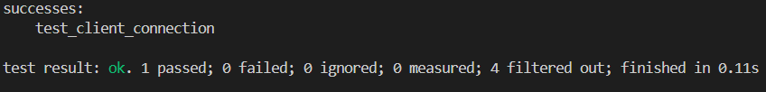
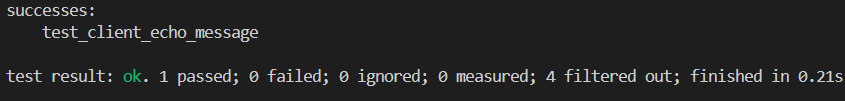
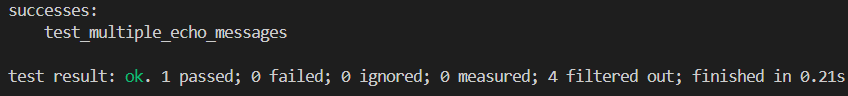
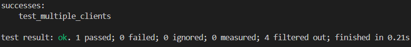
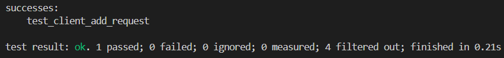

# Solution

1. Handling Incoming Messages in the Server
The server processes messages by receiving and decoding them, then sending back appropriate responses. To ensure smooth handling when multiple messages are sent in quick succession, the server clears any remaining data in the stream after processing each message. This prevents old messages from interfering with new ones. The following lines in the handle function achieve this:

        self.stream.set_nonblocking(true)?; 
        while self.stream.read(&mut buffer).is_ok() {} 
        self.stream.set_nonblocking(false)?;

2. Supporting Multiple Clients Simultaneously
To enable the server to handle multiple clients at once, each client connection is handled in its own thread. This ensures that each client is processed independently without blocking others. The implementation in the run function looks like this:

        thread::spawn(move || {
            let mut client = Client::new(stream);

            while is_running_clone.load(Ordering::SeqCst) {
                if let Err(e) = client.handle() {
                    error!("Error handling client: {}", e);
                    break;
                }
            }

            info!("Client at {} disconnected", addr);
            println!("Client at {} disconnected", addr);
        });
Additionally, the handle function also spawns a separate thread for processing and responding to client messages, enhancing speed and stability.

3. Passing the AddRequest Test
To pass the AddRequest test, the server identifies and processes AddRequest messages in the handle function. When such a message is received, it calculates the sum of the two numbers (a and b) provided, then sends back an AddResponse message with the result. This logic is implemented as follows:

        if let Ok(client_message) = ClientMessage::decode(&buffer[..bytes_read]) {
            if let Some(ClientMessageType::AddRequest(add_request)) = client_message.message {
                let result = add_request.a + add_request.b;
                let add_response = AddResponse { result };

                let server_message = ServerMessage {
                    message: Some(ServerMessageType::AddResponse(add_response)),
                };

                let payload = server_message.encode_to_vec();
                if let Err(e) = local_stream.write_all(&payload) {
                    error!("Failed to write AddResponse to stream: {}", e);
                    break;
                }
            }
        }
The following imports were added to enable this functionality:

        use crate::message::{ClientMessage, ServerMessage, AddResponse};
        use crate::message::client_message::Message as ClientMessageType;
        use crate::message::server_message::Message as ServerMessageType;

Tests:

Note:If you run all the tests together, they will not work because all the tests are using the same port. To avoid conflicts, you should run each test separately.